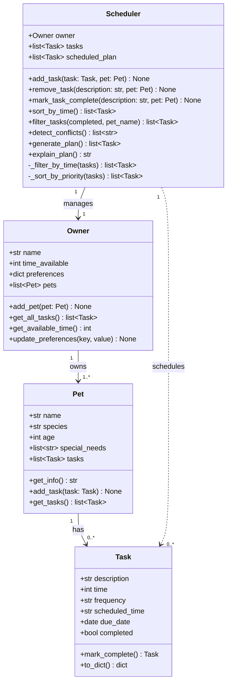

# PawPal+ — Final UML Class Diagram

## Relationship notes

- `Owner` owns one or more `Pet` objects. Each `Pet` maintains its own task list.
- `Scheduler` holds a reference to `Owner` and reads all tasks through `owner.get_all_tasks()`.
- `Task.mark_complete()` returns a new `Task` instance (the next recurrence) rather than mutating global state, keeping the method self-contained.
- `Scheduler.mark_task_complete()` is the coordinator that calls `Task.mark_complete()` and re-queues the result onto the correct `Pet`.
